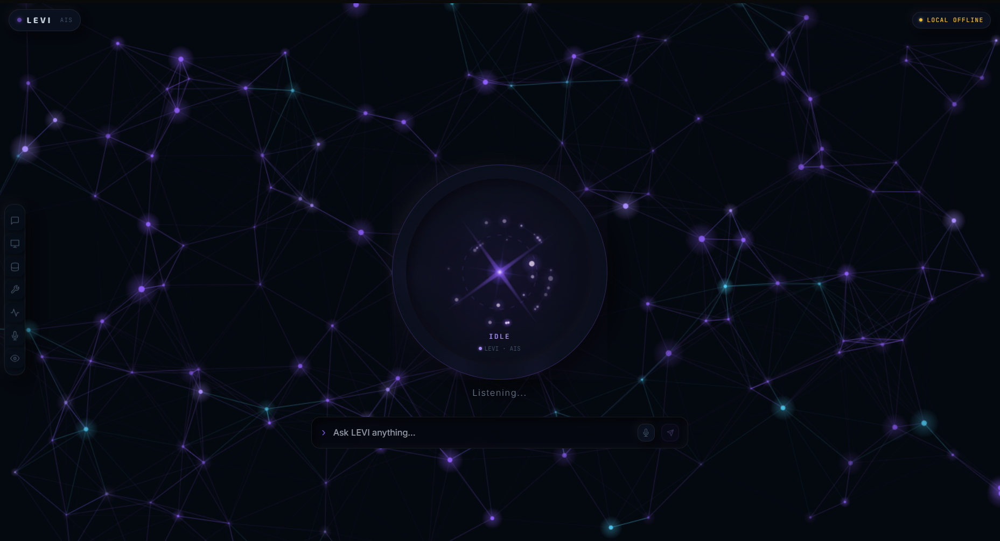

# LEVI

> **An intelligent, modern AI-powered application designed to make everyday interaction with technology simpler, faster, and more useful.**

LEVI is a personal AI project focused on building a practical and user-friendly intelligent assistant experience. It combines modern AI capabilities with a clean interface to provide users with a more natural way to interact with technology.

---

## ✨ Features

* 🤖 **AI-powered conversations**
  Interact with LEVI using natural language.

* ⚡ **Fast & responsive interface**
  Designed for a smooth and minimal user experience.

* 🧠 **Intelligent responses**
  Uses modern AI models to understand and respond to user queries.

* 💬 **Conversation-based interaction**
  Maintains a simple chat-style experience for natural communication.

* 🎨 **Modern UI**
  Clean interface designed with usability and visual simplicity in mind.

* 🔌 **API-based architecture**
  Built to work with external AI services through APIs.

---

## 🖥️ Preview

<p align="center">
  
</p>

> Replace the image above with an actual screenshot from your project.

---

## 🛠️ Tech Stack

| Technology                     | Purpose              |
| ------------------------------ | -------------------- |
| **         TypeScript       ** | User Interface       |
| **         Python           ** | Application Logic    |
| **AI API**                     | AI / LLM Integration |
| **Git & GitHub**               | Version Control      |
| **[Database, if any]**         | Data Storage         |

---

## 🏗️ Project Structure

```text
LEVI/
│
├── src/
│   ├── components/
│   ├── pages/
│   ├── services/
│   └── utils/
│
├── public/
├── assets/
├── .gitignore
├── package.json
└── README.md
```

> Update this structure according to the actual project files.

---

## 🚀 Getting Started

### 1. Clone the repository

```bash
git clone https://github.com/rexyfound/LEVI.git
```

### 2. Navigate to the project

```bash
cd LEVI
```

### 3. Install dependencies

```bash
npm install
```

### 4. Configure environment variables

Create a `.env` file:

```env
AI_API_KEY=your_api_key_here
```

Never commit your API keys or secrets to GitHub.

### 5. Start the project

```bash
npm run dev
```

The application should now be available locally.

---

## 🔑 Environment Variables

LEVI uses environment variables for sensitive configuration.

Example:

```env
AI_API_KEY=
```

Make sure `.env` is included in `.gitignore`:

```gitignore
.env
```

---

## 🧠 How LEVI Works

```text
User
  │
  ▼
LEVI Interface
  │
  ▼
Request Processing
  │
  ▼
AI / LLM API
  │
  ▼
Response Processing
  │
  ▼
User
```

The user sends a request through the LEVI interface. The application processes the request and communicates with the configured AI service. The generated response is then processed and displayed back to the user.

---

## 🎯 Project Goals

LEVI was developed with the following goals:

* Build a practical AI-powered application.
* Understand how AI APIs can be integrated into real applications.
* Create a clean and intuitive user interface.
* Learn how frontend, backend, and AI services communicate.
* Develop a project that can be continuously improved and expanded.

---

## 🔮 Future Improvements

Planned improvements may include:

* [ ] Voice interaction
* [ ] Persistent conversation history
* [ ] User authentication
* [ ] Custom AI personalities
* [ ] Tool and plugin integrations
* [ ] Improved context and memory
* [ ] Mobile application
* [ ] Local / offline AI support
* [ ] Advanced personalization

---

## 📌 Current Status

**Development Status:** 🟢 Active Development

LEVI is an evolving project. New features, improvements, and experiments are continuously being explored.

---

## 👨‍💻 Developer

**Raksham Gureja**

Diploma in Computer Science & Engineering

GitHub: [@rexyfound](https://github.com/rexyfound)

---

## 📄 License

This project is currently available for educational and development purposes.

---

<p align="center">
  Built with curiosity, code, and an unreasonable amount of debugging.
</p>
